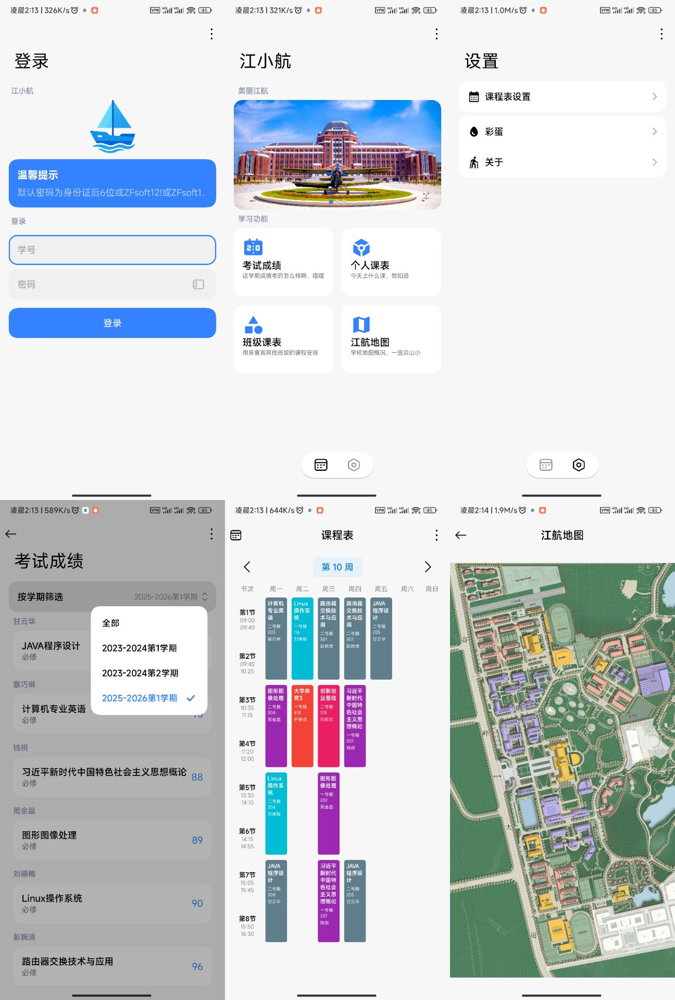

# 江小航

### 一款 [江航职院](https://www.jhzyedu.cn/) 校园生活助手

> 🎓 正方教务系统（江西航空职业技术学院）移动端重写  
> 使用 **Jetpack Compose** 实现的安卓客户端版本，目标是更现代、更流畅、更易用的教务系统体验。

## 🧩 项目图片

## 📌 项目简介

`江小航` 是基于 **Jetpack Compose** 和现代 Android 开发技术栈构建的江西航空职业技术学院教务系统客户端。旨在替代传统
Web 视图式的教务系统，以更符合现代安卓体验的方式展示课程、成绩、课表等信息。

该项目由 @paditianxiu 维护，当前仍在开发中，欢迎大家 ⭐ 和贡献代码！

## 🚀 功能亮点

- 🧠 使用 **Jetpack Compose** 构建 UI，简洁、响应式
- 🔐 支持用户登录
- 📅 查看课表
- 📊 查询成绩
- 📇 个人信息展示
- 📡 网络请求异步处理
- 📱 支持多屏适配

> ⚠️ 当前项目可能处于初版或开发阶段，部分功能仍在完善中。

## 📦 技术栈

- Kotlin
- Jetpack Compose
- Ktor
- MVVM 架构
- ViewModel + LiveData / Flow
- Gradle Kotlin DSL

## 📁 项目结构

